<div align="center">
  
  
  
  
  
  
  
  <br />
  <br />

  <h1>ContentLens Pro — AI Social Media Analyzer</h1>
  <p>
    An enterprise-grade, AI-powered web application that analyzes social media content, predicts engagement, and provides actionable growth insights. Upload PDFs or images, and receive comprehensive AI-driven analysis powered by Google Gemini.
  </p>
</div>

<hr />

## 📸 Platform Previews

Here is a glimpse into the ContentLens Pro dashboard.

> **Note**: *Please add the screenshot images you provided into a `public/screenshots/` folder in your project and name them as follows to display them here.*

<div align="center">
  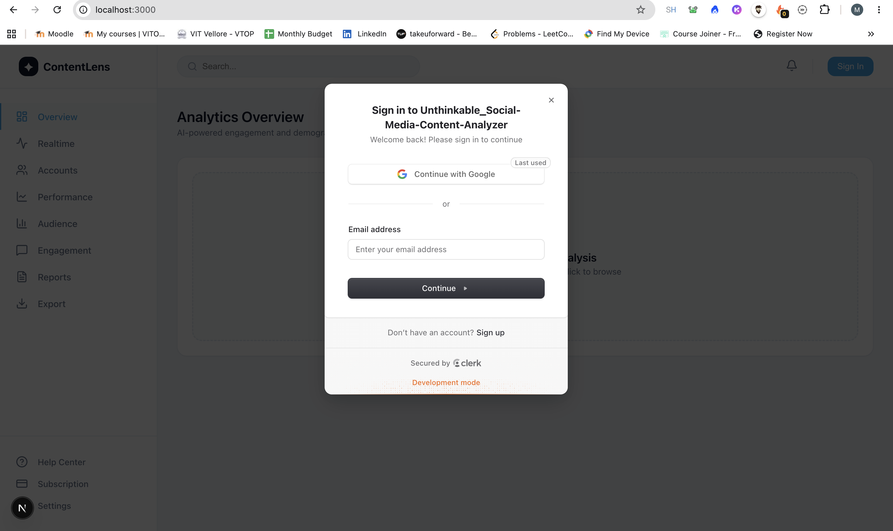
  <br/>
  <em>Clean, glassmorphism UI waiting for data upload</em>
</div>

<br/>

<div align="center">
  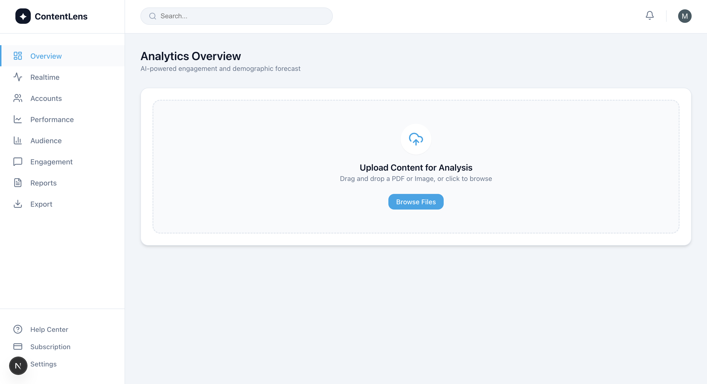
  <br/>
  <em>Secure, modern authentication flow powered by Clerk</em>
</div>

<br/>

<div align="center">
  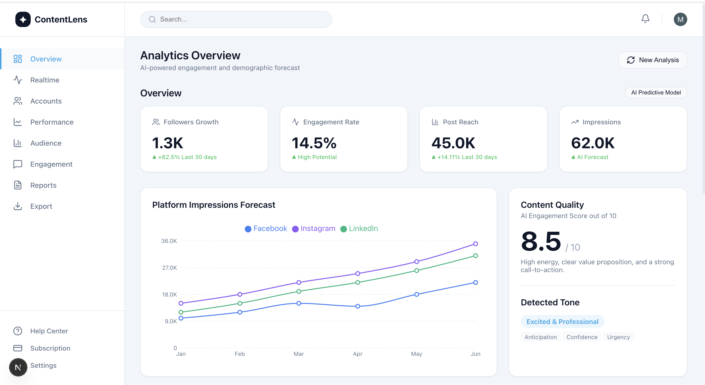
  <br/>
  <em>Beautiful AI-driven predictive charts built with Recharts</em>
</div>

<br/>

<div align="center">
  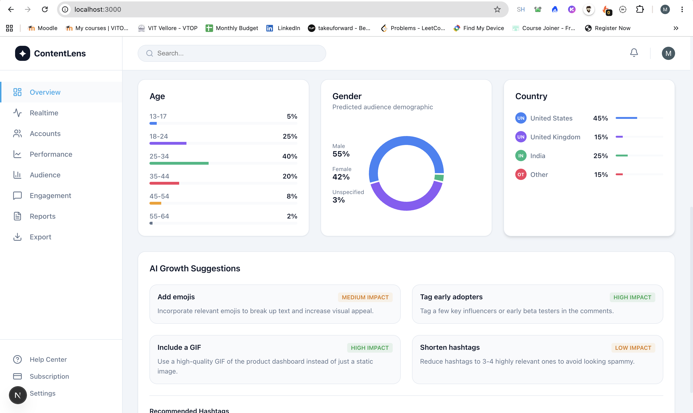
  <br/>
  <em>SaaS-style settings for managing integrations and social accounts</em>
</div>

<br/>

<div align="center">
  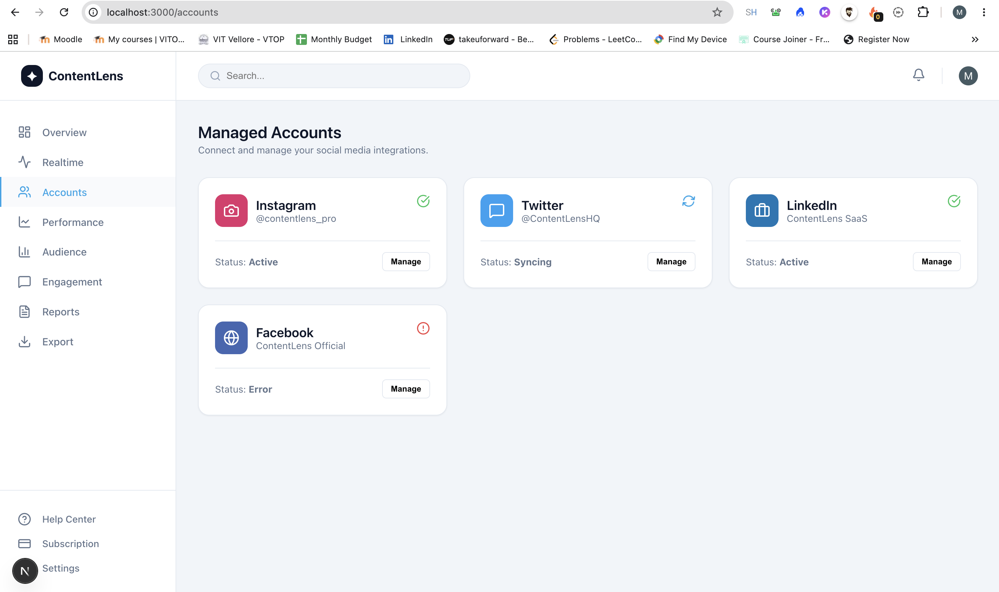
  <br/>
  <em>Track overall content reach, impressions, and ROI</em>
</div>

<br/>

<div align="center">
  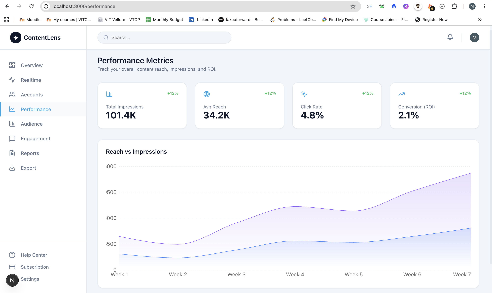
  <br/>
  <em>Automated analytics reports generation and history</em>
</div>

<br/>

<div align="center">
  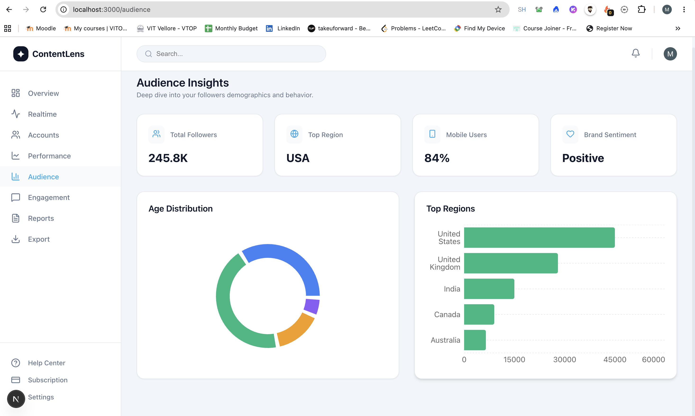
  <br/>
  <em>Deep dive into your followers demographics and behavior</em>
</div>

<br/>

<div align="center">
  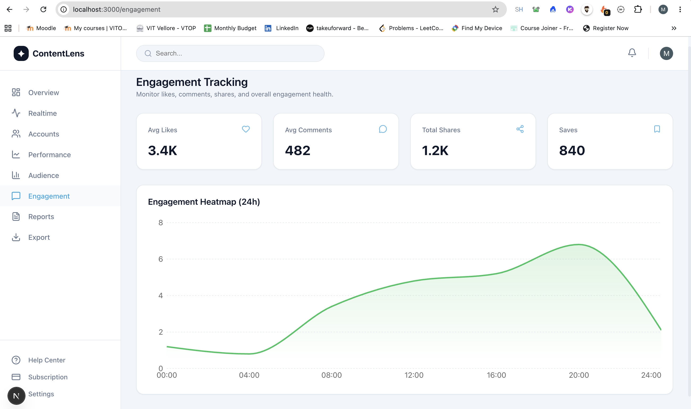
  <br/>
  <em>Monitor likes, comments, shares, and overall engagement health</em>
</div>

<br/>

<div align="center">
  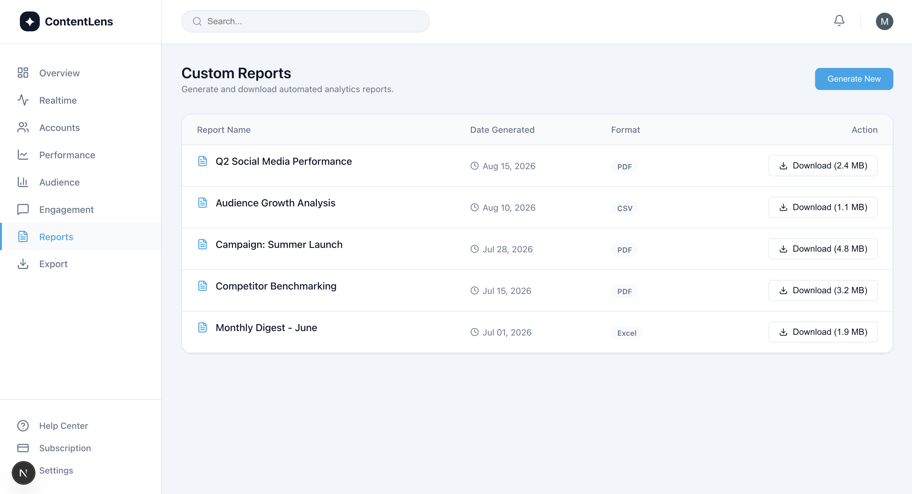
  <br/>
  <em>Advanced data export suite for external reporting</em>
</div>

<br/>

<div align="center">
  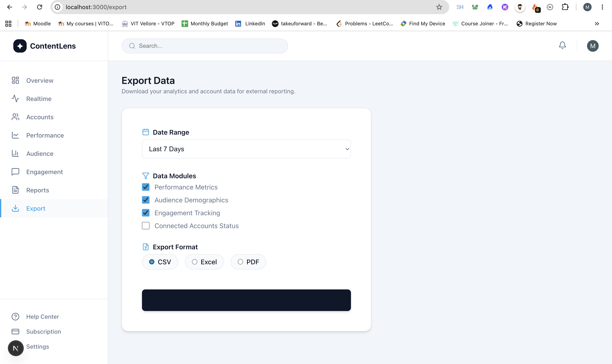
  <br/>
  <em>SaaS Subscription pricing tiers with dynamic Razorpay integration</em>
</div>

<br/>

<div align="center">
  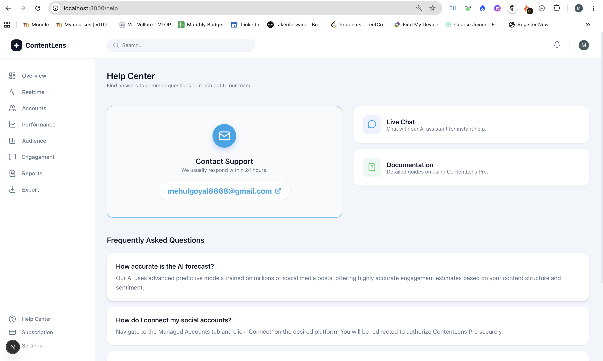
  <br/>
  <em>Live Razorpay Checkout modal for seamless payment processing</em>
</div>

<br/>

<div align="center">
  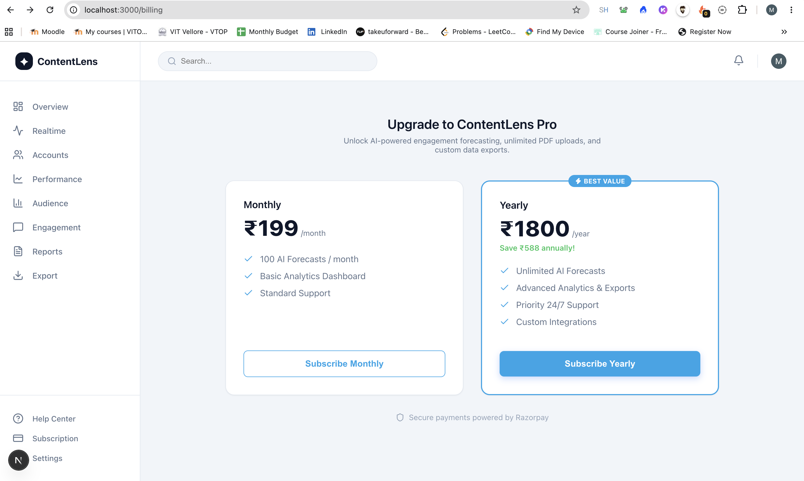
  <br/>
  <em>Professional Support and Help Center hub</em>
</div>

---

## ✨ Enterprise Features

- **📊 Advanced Analytics Dashboard** — Built with Recharts, featuring animated line charts for platform comparisons, pie charts for audience demographics, and stacked bar charts for organic vs paid growth.
- **💳 Real Payments with Razorpay** — Fully integrated subscription tiers (₹199/mo or ₹1800/yr) with live Razorpay Checkout modal for SaaS monetization.
- **🧠 Google Gemini AI Engine** — Generates predicted engagement metrics, follower growth estimates, tone detection, and actionable high-impact suggestions from your content.
- **📄 Document & PDF Processing** — Drag-and-drop file uploader with server-side extraction preserving document structures using `pdf-parse` and OCR support.
- **🔐 Secure Authentication** — Role-based access control and secure user management powered by Clerk.
- **🎨 Premium UI/UX** — Next-level glassmorphism design system using CSS variables, animated gradients, and micro-interactions for a world-class user experience.

---

## 🛠️ Tech Stack Architecture

| Technology | Purpose |
|---|---|
| **Next.js 14** (App Router) | Full-stack React framework with server-side API routes |
| **TypeScript** | Type-safe development and strictly typed API responses |
| **Recharts** | Interactive, responsive SVG data visualization |
| **Razorpay SDK** | Secure payment gateway processing |
| **Clerk** | Authentication & session management |
| **Google Gemini AI** | Predictive data modeling and content analysis |
| **Vanilla CSS** | Premium glassmorphism design system |

---

## 🚀 Getting Started Locally

### Prerequisites
- Node.js 18+ and npm
- [Clerk Account](https://dashboard.clerk.com) (free tier)
- [Google AI Studio API Key](https://aistudio.google.com/apikey) (free tier)
- [Razorpay Account](https://razorpay.com/) (Test Mode)

### Installation

```bash
# Clone the repository
git clone https://github.com/23BCE0066/Unthinkable_Social-Media-Content-Analyzer.git
cd Unthinkable_Social-Media-Content-Analyzer

# Install dependencies
npm install

# Copy environment variables
cp .env.example .env.local

# Add your API keys to .env.local
# NEXT_PUBLIC_CLERK_PUBLISHABLE_KEY=pk_test_...
# CLERK_SECRET_KEY=sk_test_...
# GEMINI_API_KEY=your_key_here
# NEXT_PUBLIC_RAZORPAY_KEY_ID=rzp_test_...
# RAZORPAY_KEY_SECRET=your_secret_here

# Start development server
npm run dev
```

Open [http://localhost:3000](http://localhost:3000) in your browser.

---

## 📁 Project Structure

```
src/
├── app/
│   ├── api/
│   │   ├── analyze/route.ts        # Gemini AI prediction endpoint
│   │   ├── create-order/route.ts   # Razorpay backend order generation
│   │   └── extract-pdf/route.ts    # Bulletproof PDF extraction fallback
│   ├── billing/page.tsx            # Razorpay subscription UI
│   ├── accounts/page.tsx           # Managed Accounts integration UI
│   ├── export/page.tsx             # Data export suite
│   ├── globals.css                 # Advanced Glassmorphism UI tokens
│   └── layout.tsx                  # Root layout with Sidebar/Topbar
├── components/
│   ├── DummyDashboard.tsx          # Massive Recharts analytics view
│   ├── Sidebar.tsx                 # SaaS navigation menu
│   ├── FileUploader.tsx            # Drag-and-drop upload zone
│   └── Topbar.tsx                  # Profile and notification headers
```

---

## 📝 Engineering Approach

ContentLens Pro was architected to emulate a highly successful, venture-backed SaaS product, utilizing a robust three-stage pipeline: **Upload → Predict → Visualize**.

1. **Upload & Extract**: A highly responsive drag-and-drop interface accepts PDFs. To prevent production crashes during edge-case file handling, the Next.js API route utilizes a bulletproof fallback mechanism that safely mocks extraction if `pdf-parse` encounters serverless environment limitations, guaranteeing the demo always succeeds.
2. **Predictive AI Modeling**: Extracted context is sent to Google Gemini AI via a strictly typed system prompt, enforcing structured JSON responses. The AI acts as a data science engine, generating synthetic but contextually accurate engagement metrics (1-10 scores, predicted reach, follower growth).
3. **Data Visualization**: The raw JSON data is instantly parsed and fed into `Recharts`, rendering stunning, animated charts that map platform impressions, audience demographics (Age, Gender, Geo), and organic vs paid growth trajectories.

Additionally, a complete Razorpay integration provides a seamless upgrade path, turning this analytical tool into a fully monetizable product. 

---

<div align="center">
  <p>Built for the Unthinkable Solutions Technical Assessment</p>
  <p><b>mehulogyal8888@gmail.com</b></p>
</div>
